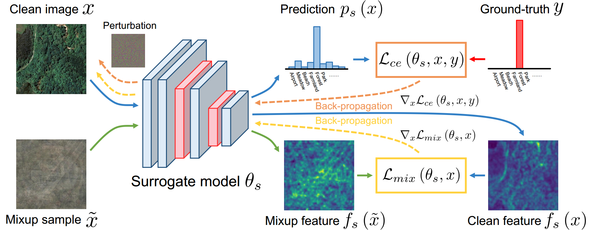
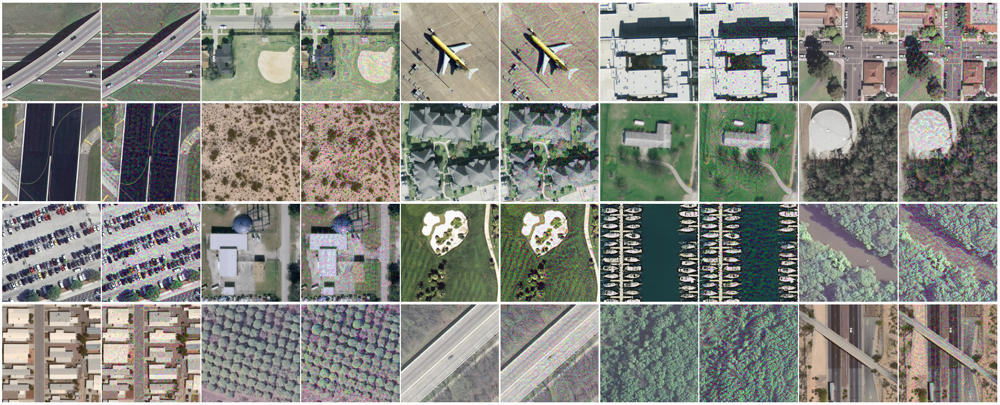
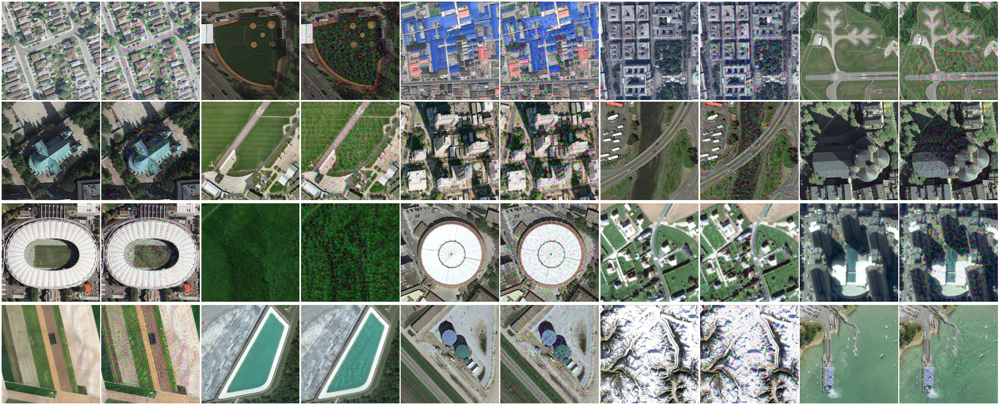
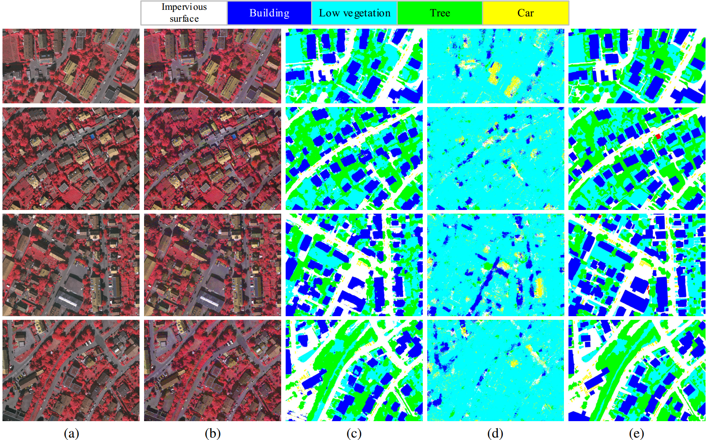

<h1 align="center">Universal Adversarial Examples in Remote Sensing: Methodology and Benchmark</h1>

<h3 align="center"> <a href="https://yonghaoxu.github.io/">Yonghao Xu</a>, <a href="http://pedram-ghamisi.com/">Pedram Ghamisi</a></h3>
<br>



This is the official PyTorch implementation of the black-box adversarial attack methods for remote sensing data in our paper **[Universal adversarial examples in remote sensing: Methodology and benchmark](https://arxiv.org)**.

### Table of content
 1. [Dataset](#dataset)
 2. [Supported methods and models](#method)
 3. [Preparation](#preparation)
 4. [Adversarial attacks on scene classification](#cls)
 5. [Adversarial attacks on semantic segmentation](#seg)
 6. [Performance evaluation on the UAE-RS dataset](#uaers)
 7. [Paper](#paper)
 8. [Acknowledgement](#acknowledgement)
 9. [License](#license)

### Dataset 
We collect the generated universal adversarial examples in the dataset named UAE-RS, which is the first dataset that provides black-box adversarial samples in the remote sensing field.

📡 **Download links:**  &nbsp;**[Google Drive](https://drive.google.com/file/d/1tbRSDJwhpk-uMYk2t-RUgC07x2wyUxAL/view?usp=sharing)** &nbsp;&nbsp;&nbsp;&nbsp;&nbsp;&nbsp; **[Baidu NetDisk](https://pan.baidu.com/s/12SK3jfQ8-p_gU87YVEFMtw)** (Code: 8g1r)

To build UAE-RS, we use the *Mixcut-Attack* method to attack `ResNet18` with 1050 test samples from the **UCM dataset** and 5000 test samples from the **AID dataset** for scene classification, and use the *Mixup-Attack* method to attack `FCN-8s` with 5 test images from the **Vaihingen dataset** (image IDs: 11, 15, 28, 30, 34) and 5 test images from the **Zurich Summer** dataset (image IDs: 16, 17, 18, 19, 20) for semantic segmentation.


<p align="center">Example images in the UCM dataset and the corresponding adversarial examples in the UAE-RS dataset.</p>


<p align="center">Example images in the AID dataset and the corresponding adversarial examples in the UAE-RS dataset.</p>


<p align="center">Qualitative results of the black-box adversarial attacks from FCN-8s → SegNet on the Vaihingen dataset.</p>
(a) The original clean test images in the Vaihingen dataset. (b) The corresponding adversarial examples in the UAE-RS dataset. (c) Segmentation results of SegNet on the clean images. (d) Segmentation results of SegNet on the adversarial images. (e) Ground-truth annotations.


### Supported methods and models <a name="method"></a>
This repo contains implementations of black-box adversarial attacks for remote sensing data on both scene classification and semantic segmentation tasks.
- Adversarial attack methods:
  - [FGSM](https://arxiv.org/abs/1412.6572)
  - [I-FGSM](https://arxiv.org/abs/1611.01236)
  - [C&W](https://arxiv.org/abs/1608.04644)
  - [TPGD](https://arxiv.org/abs/1901.08573)
  - [Jitter](https://arxiv.org/abs/2105.10304)
  - [Mixup-Attack](https://arxiv.org)
  - [Mixcut-Attack](https://arxiv.org)
- Scene classification models:
  - [AlexNet](https://proceedings.neurips.cc/paper/2012/hash/c399862d3b9d6b76c8436e924a68c45b-Abstract.html)
  - [VGG11, VGG16, VGG19](https://arxiv.org/abs/1409.1556)
  - [Inception-v3](https://www.cv-foundation.org/openaccess/content_cvpr_2016/html/Szegedy_Rethinking_the_Inception_CVPR_2016_paper.html)
  - [ResNet18, ResNet50, ResNet101](http://openaccess.thecvf.com/content_cvpr_2016/html/He_Deep_Residual_Learning_CVPR_2016_paper.html)
  - [ResNeXt50, ResNeXt101](http://openaccess.thecvf.com/content_cvpr_2017/html/Xie_Aggregated_Residual_Transformations_CVPR_2017_paper.html)
  - [DenseNet121, DenseNet169, DenseNet201](http://openaccess.thecvf.com/content_cvpr_2017/html/Huang_Densely_Connected_Convolutional_CVPR_2017_paper.html)
  - [RegNetX-400MF, RegNetX-8GF, RegNetX-16GF](http://openaccess.thecvf.com/content_CVPR_2020/html/Radosavovic_Designing_Network_Design_Spaces_CVPR_2020_paper.html)
- Semantic segmentation models:
  - [FCN-32s, FCN-16s, FCN-8s](http://openaccess.thecvf.com/content_cvpr_2015/html/Long_Fully_Convolutional_Networks_2015_CVPR_paper.html)
  - [DeepLab-v2](https://ieeexplore.ieee.org/abstract/document/7913730/)
  - [DeepLab-v3+](http://openaccess.thecvf.com/content_ECCV_2018/html/Liang-Chieh_Chen_Encoder-Decoder_with_Atrous_ECCV_2018_paper.html)
  - [SegNet](https://ieeexplore.ieee.org/abstract/document/7803544/)
  - [ICNet](http://openaccess.thecvf.com/content_ECCV_2018/html/Hengshuang_Zhao_ICNet_for_Real-Time_ECCV_2018_paper.html)
  - [ContextNet](https://arxiv.org/abs/1805.04554)
  - [SQNet](https://openreview.net/forum?id=S1uHiFyyg)
  - [PSPNet](http://openaccess.thecvf.com/content_cvpr_2017/html/Zhao_Pyramid_Scene_Parsing_CVPR_2017_paper.html)
  - [U-Net](https://link.springer.com/chapter/10.1007/978-3-319-24574-4_28)
  - [LinkNet](https://ieeexplore.ieee.org/abstract/document/8305148/)
  - [FRRNet-A, FRRNet-B](http://openaccess.thecvf.com/content_cvpr_2017/html/Pohlen_Full-Resolution_Residual_Networks_CVPR_2017_paper.html)
### Preparation
- Package requirements: The scripts in this repo are tested with `torch==1.10` and `torchvision==0.11` using two NVIDIA Tesla V100 GPUs.
- Remote sensing datasets used in this repo:
  - [UCM dataset](http://weegee.vision.ucmerced.edu/datasets/landuse.html)
  - [AID dataset](https://captain-whu.github.io/AID/)
  - [Vaihingen dataset](http://www2.isprs.org/commissions/comm3/wg4/2d-sem-label-vaihingen.html)
  - [Zurich Summer dataset](https://sites.google.com/site/michelevolpiresearch/data/zurich-dataset)
- Data folder structure
  - The data folder is structured as follows:
```
├── <THE-ROOT-PATH-OF-DATA>/
│   ├── UCMerced_LandUse/     
|   |   ├── Images/
|   |   |   ├── agricultural/
|   |   |   ├── airplane/
|   |   |   |── ...
│   ├── AID/     
|   |   ├── Airport/
|   |   ├── BareLand/
|   |   |── ...
│   ├── Vaihingen/     
|   |   ├── img/
|   |   ├── gt/
|   |   ├── ...
│   ├── Zurich/    
|   |   ├── img/
|   |   ├── gt/
|   |   ├── ...
│   ├── UAE-RS/    
|   |   ├── UCM/
|   |   ├── AID/
|   |   ├── Vaihingen/
|   |   ├── Zurich/
```
- Pretraining the models for scene classification
```
CUDA_VISIBLE_DEVICES=0,1 python pretrain_cls.py --network 'alexnet' --dataID 1 --root_dir <THE-ROOT-PATH-OF-DATA>
CUDA_VISIBLE_DEVICES=0,1 python pretrain_cls.py --network 'resnet18' --dataID 1 --root_dir <THE-ROOT-PATH-OF-DATA>
CUDA_VISIBLE_DEVICES=0,1 python pretrain_cls.py --network 'inception' --dataID 1 --root_dir <THE-ROOT-PATH-OF-DATA>
...
```
- Pretraining the models for semantic segmentation
```
cd ./segmentation
CUDA_VISIBLE_DEVICES=0 python pretrain_seg.py --model 'fcn8s' --dataID 1 --root_dir <THE-ROOT-PATH-OF-DATA>
CUDA_VISIBLE_DEVICES=0 python pretrain_seg.py --model 'deeplabv2' --dataID 1 --root_dir <THE-ROOT-PATH-OF-DATA>
CUDA_VISIBLE_DEVICES=0 python pretrain_seg.py --model 'segnet' --dataID 1 --root_dir <THE-ROOT-PATH-OF-DATA>
...
```
Please replace `<THE-ROOT-PATH-OF-DATA>` with the local path where you store the remote sensing datasets.
### Adversarial attacks on scene classification <a name="cls"></a>
- Generate adversarial examples:
```
CUDA_VISIBLE_DEVICES=0 python attack_cls.py --surrogate_model 'resnet18' \
                                            --attack_func 'fgsm' \
                                            --dataID 1 \
                                            --root_dir <THE-ROOT-PATH-OF-DATA>
```
- Performance evaluation on the adversarial test set:
```
CUDA_VISIBLE_DEVICES=0 python test_cls.py --surrogate_model 'resnet18' \
                                          --target_model 'inception' \
                                          --attack_func 'fgsm' \
                                          --dataID 1 \
                                          --root_dir <THE-ROOT-PATH-OF-DATA>
```
You can change parameters `--surrogate_model`, `--attack_func`, and `--target_model` to evaluate the performance with different attacking scenarios.
### Adversarial attacks on semantic segmentation <a name="seg"></a>
- Generate adversarial examples:
```
cd ./segmentation
CUDA_VISIBLE_DEVICES=0 python attack_seg.py --surrogate_model 'fcn8s' \
                                            --attack_func 'fgsm' \
                                            --dataID 1 \
                                            --root_dir <THE-ROOT-PATH-OF-DATA>
```
- Performance evaluation on the adversarial test set:
```
CUDA_VISIBLE_DEVICES=0 python test_seg.py --surrogate_model 'fcn8s' \
                                          --target_model 'segnet' \
                                          --attack_func 'fgsm' \
                                          --dataID 1 \
                                          --root_dir <THE-ROOT-PATH-OF-DATA>
```
You can change parameters `--surrogate_model`, `--attack_func`, and `--target_model` to evaluate the performance with different attacking scenarios.
### Performance evaluation on the UAE-RS dataset <a name="uaers"></a>
- Scene classification:
```
CUDA_VISIBLE_DEVICES=0 python test_cls_uae_rs.py --target_model 'inception' \
                                                 --dataID 1 \
                                                 --root_dir <THE-ROOT-PATH-OF-DATA>
```
Scene classification results of different deep neural networks on the clean and UAE-RS test sets:

|               |       UCM       |                      |         |       AID       |                      |         |
|:-------------:|:---------------:|:--------------------:|:-------:|:---------------:|:--------------------:|:-------:|
|     Model     | Clean Test Set  | Adversarial Test Set |  OA Gap | Clean Test Set  | Adversarial Test Set |  OA Gap |
|    AlexNet    |      90.28      |        30.86         | -59.42  |      89.74      |        18.26         | -71.48  |
|     VGG11     |      94.57      |        26.57         | -68.00  |      91.22      |        12.62         | -78.60  |
|     VGG16     |      93.04      |        19.52         | -73.52  |      90.00      |        13.46         | -76.54  |
|     VGG19     |      92.85      |        29.62         | -63.23  |      88.30      |        15.44         | -72.86  |
|  Inception-v3 |      96.28      |        24.86         | -71.42  |      92.98      |        23.48         | -69.50  |
|    ResNet18   |      95.90      |         2.95         | -92.95  |      94.76      |         0.02         | -94.74  |
|    ResNet50   |      96.76      |        25.52         | -71.24  |      92.68      |         6.20         | -86.48  |
|   ResNet101   |      95.80      |        28.10         | -67.70  |      92.92      |         9.74         | -83.18  |
|   ResNeXt50   |      97.33      |        26.76         | -70.57  |      93.50      |        11.78         | -81.72  |
|   ResNeXt101  |      97.33      |        33.52         | -63.81  |      95.46      |        12.60         | -82.86  |
|  DenseNet121  |      97.04      |        17.14         | -79.90  |      95.50      |        10.16         | -85.34  |
|  DenseNet169  |      97.42      |        25.90         | -71.52  |      95.54      |         9.72         | -85.82  |
|  DenseNet201  |      97.33      |        26.38         | -70.95  |      96.30      |         9.60         | -86.70  |
| RegNetX-400MF |      94.57      |        27.33         | -67.24  |      94.38      |        19.18         | -75.20  |
|  RegNetX-8GF  |      97.14      |        40.76         | -56.38  |      96.22      |        19.24         | -76.98  |
|  RegNetX-16GF |      97.90      |        34.86         | -63.04  |      95.84      |        13.34         | -82.50  |
- Semantic segmentation:
```
cd ./segmentation
CUDA_VISIBLE_DEVICES=0 python test_seg_uae_rs.py --target_model 'segnet' \
                                                 --dataID 1 \
                                                 --root_dir <THE-ROOT-PATH-OF-DATA>
```
Semantic segmentation results of different deep neural networks on the clean and UAE-RS test sets:

|              |    Vaihingen    |                      |         |  Zurich Summer  |                      |         |
|:------------:|:---------------:|:--------------------:|:-------:|:---------------:|:--------------------:|:-------:|
|     Model    | Clean Test Set  | Adversarial Test Set | mF1 Gap | Clean Test Set  | Adversarial Test Set | mF1 Gap |
|    FCN-32s   |      69.48      |        35.00         | -34.48  |      66.26      |        32.31         | -33.95  |
|    FCN-16s   |      69.70      |        27.02         | -42.68  |      66.34      |        34.80         | -31.54  |
|   FCN-8s     |      82.22      |        22.04         | -60.18  |      79.90      |        40.52         | -39.38  |
|  DeepLab-v2  |      77.04      |        34.12         | -42.92  |      74.38      |        45.48         | -28.90  |
| DeepLab-v3+  |      84.36      |        14.56         | -69.80  |      82.51      |        62.55         | -19.96  |
|    SegNet    |      78.70      |        17.84         | -60.86  |      75.59      |        35.58         | -40.01  |
|    ICNet     |      80.89      |        41.00         | -39.89  |      78.87      |        59.77         | -19.10  |
|  ContextNet  |      81.17      |        47.80         | -33.37  |      77.89      |        63.71         | -14.18  |
|     SQNet    |      81.85      |        39.08         | -42.77  |      76.32      |        55.29         | -21.03  |
|    PSPNet    |      83.11      |        21.43         | -61.68  |      77.55      |        65.39         | -12.16  |
|     U-Net    |      83.61      |        16.09         | -67.52  |      80.78      |        56.58         | -24.20  |
|    LinkNet   |      82.30      |        24.36         | -57.94  |      79.98      |        48.67         | -31.31  |
|    FRRNetA   |      84.17      |        16.75         | -67.42  |      80.50      |        58.20         | -22.30  |
|    FRRNetB   |      84.27      |        28.03         | -56.24  |      79.27      |        67.31         | -11.96  |

### Paper
**[Universal adversarial examples in remote sensing: Methodology and benchmark](https://arxiv.org)**

Please cite the following paper if you use the data or the code:

```
@article{uaers,
  title={Universal adversarial examples in remote sensing: Methodology and benchmark}, 
  author={Xu, Yonghao and Ghamisi, Pedram},
  journal={}, 
  volume={},
  pages={},
  year={2022},
}
```

### Acknowledgement
The authors would like to thank Prof. Shawn Newsam for making the UCM dataset public available, Prof. Gui-Song Xia for providing the AID dataset, the International Society for Photogrammetry and Remote Sensing (ISPRS), and the German Society for Photogrammetry, Remote Sensing and Geoinformation (DGPF) for providing the Vaihingen dataset, and Dr. Michele Volpi for providing the Zurich Summer dataset.

[Efficient-Segmentation-Networks](https://github.com/xiaoyufenfei/Efficient-Segmentation-Networks)

[segmentation_models.pytorch](https://github.com/qubvel/segmentation_models.pytorch)

[Adversarial-Attacks-PyTorch](https://github.com/Harry24k/adversarial-attacks-pytorch)

### License
This repo is distributed under [MIT License](https://github.com/YonghaoXu/UAE-RS/blob/main/LICENSE). The UAE-RS dataset can be used for academic purposes only.
